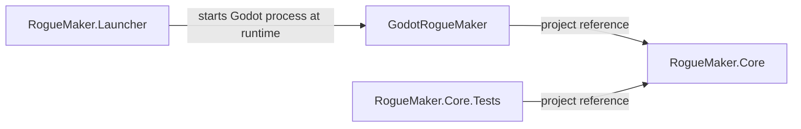
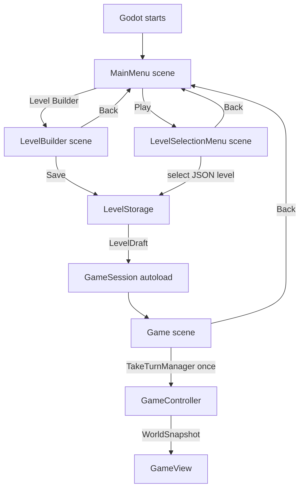
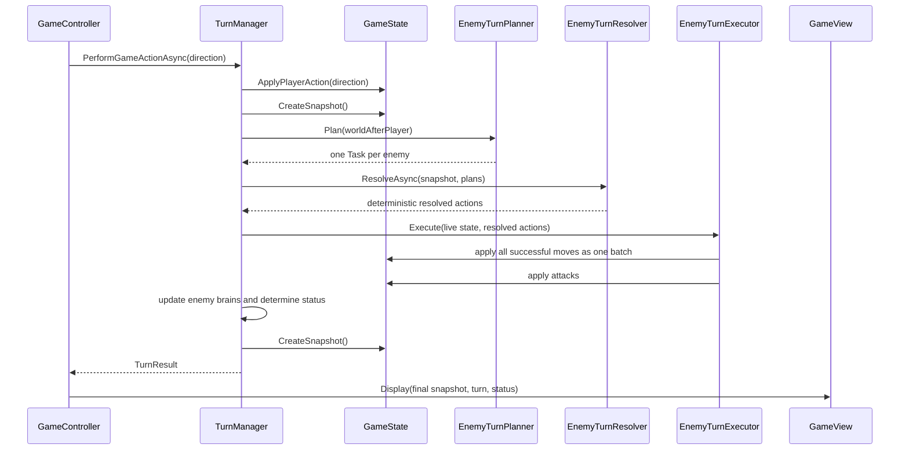

# RogueMaker Developer Guide

## 1. Technology and Prerequisites

RogueMaker is a C#/.NET 8 solution with a Godot 4.7 Mono front end.

Recommended development environment:

- .NET 8 SDK.
- Godot Engine 4.7 Mono.
- Visual Studio 2022.
- Git.
- Windows when using the current launcher.

From the directory containing `RogueMaker.sln`, restore and build the solution with:

```powershell
dotnet restore RogueMaker.sln
dotnet build RogueMaker.sln
```

Run the existing Core test project with:

```powershell
dotnet test tests/RogueMaker.Core.Tests/RogueMaker.Core.Tests.csproj
```

Run the game through the external launcher with:

```powershell
dotnet run --project src/RogueMaker.Launcher/RogueMaker.Launcher.csproj
```

The launcher currently expects Godot at:

```text
C:\Godot\Godot_v4.7-stable_mono_win64.exe
```

Change `GodotExecutable` in `src/RogueMaker.Launcher/Program.cs` when Godot is installed elsewhere.

The launcher does not have a project reference to the Godot game. It only starts an external process, so build `GodotRogueMaker.csproj` or the full solution after changing game or Core code.

## 2. Solution Projects

The main solution is `RogueMaker.sln`.

| Project | SDK and target | Responsibility | Dependencies |
|---|---|---|---|
| `RogueMaker.Core` | `Microsoft.NET.Sdk`, .NET 8 | Game rules, maps, creatures, AI, turns, snapshots, and editable level data | No project dependencies and no Godot dependency |
| `GodotRogueMaker` | `Godot.NET.Sdk/4.7.0`, .NET 8 | Godot scenes, input, rendering, navigation, level persistence, and editor UI | References `RogueMaker.Core` |
| `RogueMaker.Launcher` | `Microsoft.NET.Sdk`, .NET 8 executable | Starts the Godot executable with the game project path | No project references |
| `RogueMaker.Core.Tests` | xUnit, .NET 8 | Automated tests for Core rules and algorithms | References `RogueMaker.Core` |




The most important boundary is that `RogueMaker.Core` must remain independent of Godot. Core should accept domain values such as `Direction`, `Position`, or `LevelDraft`, and return domain results such as `TurnResult` or `WorldSnapshot`. Godot types such as `Node`, `Vector2`, `InputEvent`, and `Texture2D` belong in `RogueMaker.Game`.

## 3. Repository Layout

Generated directories such as `bin`, `obj`, and `.godot` are omitted below.

```text
RogueMaker/
├── RogueMaker.sln
├── DEVELOPER_GUIDE.md
├── USER_GUIDE.md
├── src/
│   ├── RogueMaker.Core/
│   │   ├── Actions/       describe how enemy can change game world, what he can do
│   │   ├── AI/            Enemy brain contracts and implementations
│   │   ├── Creatures/     Player, enemies, their stats, IDs, and snapshots of enemies and player
│   │   ├── Enemies/       Enemy type definitions and definition of enemy catalog 
│   │   ├── Game/          Live state, content, occupancy, and world snapshots
│   │   ├── Levels/        Mutable LevelDraft used by the editor and loader, an important bridge 
│   │   │                    between Core and UI
│   │   ├── Map/           Coordinates, grids, surfaces, maps, map snapshots, holds info about   │   │   │             who  allow to move to certain surfaces 
│   │   ├── Movement/      Movement types and movement queries, can be used for enemies AI
│   │   └── Turns/         Turn orchestration and enemy conflict resolution
│   ├── RogueMaker.Game/
│   │   ├── Assets/        Imported textures and GameTextures.tres
│   │   ├── Game/          Gameplay scene, controller, view, and session handoff
│   │   ├── Levels/        JSON save/load adapter
│   │   ├── UI/            Main menu, level selection, and level builder
│   │   ├── Visuals/       Godot resource types used by rendering
│   │   └── project.godot  Godot entry point and autoload configuration
│   └── RogueMaker.Launcher/
│       └── Program.cs     External Godot process launcher
└── tests/
    └── RogueMaker.Core.Tests/
```

## 4. Runtime Startup and Scene Flow

`RogueMaker.Launcher/Program.cs` resolves `RogueMaker.Game` relative to the launcher's build output and starts Godot with:

```text
godot.exe --path <RogueMaker.Game directory>
```

Godot reads `project.godot`. Its main scene is `UI/MainMenu/main_menu.tscn`. The same configuration registers `GameSession` as an autoload, so one `GameSession` node survives scene changes and can transfer a newly created `TurnManager` into the gameplay scene.




1. `LevelSelectionMenu` loads a `LevelDraft`.
2. `GameSession.Start` creates a `TurnManager` and requests the scene change.
3. `GameController._Ready` calls `GameSession.TakeTurnManager`.
4. `GameSession` clears its pending reference.

This keeps live game state out of UI nodes that exist before the gameplay scene.

## 5. Core Domain Model

### 5.1. Coordinates and Grids

`Position` is a value type containing integer `X` and `Y` coordinates. The origin is the upper-left map cell. `X` grows to the right and `Y` grows downward.

`Grid<T>` stores data in a one-dimensional row-major array. The conversion is:

```text
index = y * width + x
```

Lookup and replacement are O(1). All public cell access uses `Position` to avoid accidentally reversing `x` and `y`.

### 5.2. Maps and Surfaces

The map-related types have distinct roles:

| Type | Mutability | Purpose |
|---|---|---|
| `LevelDraft` | Mutable | Editable representation used by the builder and persistence layer |
| `GameMap` | Mutable facade | Live map owned by `GameState` |
| `MapSnapshot` | Immutable | Surface version safe to share with AI and the UI |
| `IMapView` | Read-only contract | Common movement-query interface for live maps and snapshots |
| `Tile` | Immutable value | Combines a `SurfaceType` with movement rules |

`GameMap.SetSurface` uses copy-on-write: `MapSnapshot.WithSurface` clones the surface array and produces a new snapshot. An older snapshot therefore remains unchanged. This costs O(width × height) for each surface mutation, but maps are currently static during normal gameplay.

Movement permission belongs to `Tile.Allows`:

| Surface | Walking | Flying |
|---|---:|---:|
| `Floor` | Yes | Yes |
| `Wall` | No | No |
| `Pit` | No | Yes |
| `Void` | No | No |
| `Exit` | Yes | Yes |

`MovementQueries` checks surfaces only. Creature occupancy is intentionally handled by `GameState` and the enemy turn resolver.

### 5.3. Editable Levels

`LevelDraft` owns:

- a `Grid<SurfaceType>`.
- one player position.
- a dictionary mapping enemy positions to `EnemyTypeId`.

It enforces map bounds and prevents the player and an enemy from sharing a position. It intentionally does not validate the surface below an initially placed creature. Movement rules apply when the creature later tries to enter another tile.

A new draft is filled with floor, receives perimeter walls, and places the player at `(width / 2, height / 2)`. Supported dimensions are 1 through 100.

### 5.4. Creatures and Occupancy

`Creature` is the base class for `Player` and `Enemy`. It owns identity, position, stats, current health, and side. Constructors and mutation methods are restricted so that `GameState` remains responsible for valid IDs, placement, damage, and movement.

`GameState` keeps three related indexes:

- `_creatures`: every creature by `CreatureId`.
- `_enemies`: enemies by `CreatureId`, used for enemy phases.
- `CreatureOccupancy`: occupied `Position` to `CreatureId`, used for O(1) collision lookup.

Creature positions are also stored on the creature objects. Every move must update occupancy and creature position together through `GameState`. bypassing it would break the invariant.

`CreatureId` values are assigned sequentially for one game. The player receives the first ID, followed by enemies.

### 5.5. Game Content

`GameContent` is the production registry for player stats and enemy definitions. Saved levels store enemy type IDs, while `GameContent.EnemyCatalog` supplies the current `CreatureStats` and initial `IEnemyBrain` for those IDs.

`EnemyType` is immutable and contains:

- a stable `EnemyTypeId`.
- shared `CreatureStats`.
- an immutable initial brain.

This keeps balance data in one Core location instead of storing health, damage, or AI implementation details in every saved level.

### 5.6. Immutable Views

Core exposes immutable data to AI and the Godot UI:

- `MapSnapshot` captures one map surface version.
- `PlayerSnapshot` and `EnemySnapshot` capture creature values.
- `WorldSnapshot` combines them and builds lookup dictionaries by ID and position.
- `TurnResult` describes a complete turn and includes its final `WorldSnapshot`.

`GameView` from Godot UI never receives `GameState`. AI planning also uses a shared `WorldSnapshot`, which prevents planners from observing partially applied actions.

## 6. Complete Turn Algorithm

`TurnManager` owns the mutable `GameState`, turn number, and game status. A turn begins when `GameController` converts a keyboard event to a `Direction` and calls `PerformGameActionAsync`.



The detailed order is:

1. Reject the call if the game is already won or lost.
2. Apply the player's movement intent. Moving into an enemy becomes an attack. an invalid destination becomes `Blocked`.
3. Increment the turn number, including for blocked actions.
4. Capture the world after the player action.
5. Start one AI planning task per surviving enemy. Every brain sees the same snapshot.
6. Convert plans into candidates and resolve target conflicts and movement dependencies without mutating the world.
7. Apply every successful enemy move simultaneously.
8. Apply enemy attacks.
9. Pass actual outcomes back to enemy brains to produce their immutable next state.
10. Capture the final world and determine `InProgress`, `Won`, or `Lost`.
11. Return a `TurnResult` containing player outcome, enemy outcomes, deaths, snapshot, turn number, and status.

The player loses if dead. Otherwise the player wins when no enemies remain or the player stands on `Exit`. Status is evaluated after a complete turn.

### 6.1. Basic Move and Attack Resolution

`GameState.ApplyMoveAction` implements one adjacent intent:

- if the target contains an opposing creature, attack it.
- if the target contains a same-side creature, return `Blocked`.
- if the target is empty and its surface allows entry, move.
- otherwise return `Blocked`.

Damage is the attacker's `BaseDamage`. Health is clamped at zero. A dead enemy is immediately removed from creature indexes and occupancy. A dead player remains represented so the final snapshot can report the loss.

### 6.2. Enemy Planning

`EnemyTurnPlanner` starts a `Task.Run` for each enemy. An `IEnemyBrain` receives only `WorldSnapshot` and `EnemySnapshot` and returns an `EnemyAction` without mutation.

Brain implementations must therefore be:

- immutable.
- thread-safe.
- deterministic when deterministic gameplay is required.
- free of writes to the world or Godot scene tree.

Stateful AI returns a new brain from `GetNextBrain` after its planned action has been resolved.

### 6.3. Deterministic Enemy Conflict Resolution

Enemy plans are computed in parallel, but `EnemyTurnResolver` makes their result deterministic.

For each enemy move, the resolver first creates an action candidate:

- moving into the player becomes `Attacked`.
- entering an invalid surface becomes `Blocked`.
- an uncontested empty target becomes `Moved`.
- targeting an enemy creates a dependency on whether that occupant moves away.
- when several enemies target the same tile, the lower creature ID has priority.

Dependencies form directed movement components. The resolver walks each component:

- a chain ending at an empty tile succeeds and every enemy in the chain moves.
- a chain ending at a waiting, blocked, or attacking occupant is blocked.
- swaps and longer movement cycles are blocked.
- two enemies cannot claim the same target.

`CreatureOccupancy.MoveMany` validates the complete batch, removes every source, and then adds every target. This permits valid movement chains without exposing an intermediate overlapping state.

### 6.4. Chaser AI

`ChaserBrain` uses Manhattan distance and a fixed chase range of 10 cells.

When ready and in range, it:

1. tries the horizontal direction toward the player.
2. tries the vertical direction if the horizontal surface is unavailable.
3. returns the first allowed movement intent.
4. still reports the first blocked direction when every route is blocked, allowing a `Blocked` outcome to preserve the attempted target.

Occupancy is not checked by the brain. the resolver handles other creatures. After a move, attack, or blocked movement attempt, the chaser enters `Preparing` and waits for one turn before becoming `Ready` again.

`WaitBrain` is a singleton that always returns `EnemyAction.Wait`.

## 7. Godot Application Layer

### 7.1. Scenes and Scripts

| Scene or resource | Script | Responsibility |
|---|---|---|
| `UI/MainMenu/main_menu.tscn` | `MainMenu.cs` | Main navigation and application exit |
| `UI/LevelSelectionMenu/level_selection_menu.tscn` | `LevelSelectionMenu.cs` | Discover saved levels, load one, and start a game |
| `UI/LevelBuilder/LevelBuilder.tscn` | `LevelBuilder.cs` | Create `LevelDraft`, build the tool palette, apply tools, and save |
| Level builder sub-viewport | `LevelGrid.cs` | Draw the draft, convert pointer pixels to cells, and emit edit events |
| Level builder camera | `LevelEditorView.cs` | Mouse-wheel zoom, middle-button pan, and camera clamping |
| `Game/Game.tscn` | `GameController.cs` | Take the pending `TurnManager`, handle player input, and coordinate turns |
| `GameView` node | `GameView.cs` | Draw immutable snapshots and update HUD and player camera |
| Autoload | `GameSession.cs` | Transfer a `TurnManager` across the scene change into gameplay |
| `GameTextures.tres` | `GameTextures.cs` | Map domain enum values to Godot textures |

Scripts use Godot unique node names, for example `GetNode<Button>("%BackButton")`. Renaming a scene node or removing its `unique_name_in_owner` setting requires updating the corresponding script lookup.

### 7.2. Input Ownership

There is no single global input class. Input is handled by the component that owns the interaction:

| Input | Component | Godot callback or signal |
|---|---|---|
| Main menu buttons | `MainMenu` | `Button.Pressed` subscriptions in `_Ready` |
| Saved-level buttons | `LevelSelectionMenu` | Runtime-created `Button.Pressed` subscriptions |
| Builder size, tool, save, and back controls | `LevelBuilder` | UI signals subscribed in `_Ready` |
| Left-click and left-drag painting | `LevelGrid` | `_GuiInput` |
| Mouse-wheel zoom and middle-button pan | `LevelEditorView` | `_Input` inside the editor sub-viewport |
| WASD and arrow keys | `GameController` | `_UnhandledInput` |
| Gameplay back button | `GameController` | `Button.Pressed` |

`GameController` ignores key releases and key-repeat events. It marks recognized movement keys as handled and uses `_turnInProgress` to prevent overlapping asynchronous turns.

### 7.3. Level Builder Event Flow

```mermaid
flowchart LR
    Pointer["Left click or drag"] --> GridInput["LevelGrid._GuiInput"]
    GridInput --> Cell["pixel position to Position"]
    Cell --> Event["CellEdited event"]
    Event --> Builder["LevelBuilder.EditCell"]
    Builder --> Delegate["selected Func<Position, bool>"]
    Delegate --> Draft["LevelDraft mutation"]
    Draft -->|"true: value changed"| Redraw["LevelGrid.QueueRedraw"]
```

`LevelBuilder` stores editing functions as `Func<Position, bool>` delegates. `_toolActions` and the Godot `ItemList` use the same index, so selecting an item chooses the corresponding function.



Surface and enemy tools are generated by enumerating `SurfaceType` and `EnemyTypeId`. This is why new enum values automatically appear in the tool palette, provided a matching texture is registered.

`LevelGrid` uses 80 × 80 pixel cells. It redraws all surfaces, then all enemies, then the player. Repeated drag events for the same cell are suppressed with `_lastEditedPosition`.

### 7.4. Editor Camera Math

`LevelEditorView` is a `Camera2D` inside a `SubViewport`. Zoom ranges from 0.2 to 1.0 in steps of 0.2.

The map coordinate under a pointer is calculated as:

```text
mapPoint = cameraPosition + (pointerPosition - viewportCenter) / zoom
```

After changing zoom, camera position is recomputed so that `mapPoint` remains under the pointer. This is the important invariant that prevents the map from jumping toward a viewport corner. Camera panning divides mouse movement by zoom so that drag speed remains consistent in map coordinates.

### 7.5. Gameplay Rendering

`GameView` receives a complete immutable `WorldSnapshot` after each turn. It stores the snapshot, positions the `Camera2D` on the player's cell center, schedules a redraw, and updates the HUD.

`_Draw` renders:

1. every map surface.
2. every enemy.
3. the player.

The whole `GameView` is redrawn. individual tiles are not separate Godot nodes. Rendering cost is O(width × height + enemy count). Camera position smoothing is enabled in `Game.tscn`.

`GameTextures` is a custom Godot `Resource` with dictionaries keyed by `SurfaceType` and `EnemyTypeId`. Both the builder and gameplay view use the same `Assets/Textures/GameTextures.tres` resource.

## 8. Persistence and External Data

`LevelStorage` is the only persistence component. It reads and writes local JSON files with `System.Text.Json`.

Files are stored under Godot's:

```text
user://levels
```

`ProjectSettings.GlobalizePath` converts this to an operating-system path. File names use local time with the format `yyyy-MM-dd_HH-mm-ss-ff.json`.

json example:
```json
{
  "Width": 3,
  "Height": 3,
  "Surfaces": [
    ["Wall", "Wall", "Wall"],
    ["Wall", "Floor", "Exit"],
    ["Wall", "Wall", "Wall"]
  ],
  "PlayerPosition": {
    "X": 1,
    "Y": 1
  },
  "Enemies": [
    {
      "Position": {
        "X": 2,
        "Y": 1
      },
      "EnemyType": "Bat"
    }
  ]
}
```


Saving converts a `LevelDraft` to SavedLevel. Loading performs the reverse conversion and validates:

- dimensions and surface row lengths.
- defined surface and enemy enum values.
- player and enemy bounds.
- unique enemy positions.
- no player/enemy overlap.

`LevelSelectionMenu` uses Godot `DirAccess` to list JSON files and sorts their names case-insensitively. It passes the selected file to `LevelStorage.Load` and shows exceptions in the UI and Godot error log.


## 9. Extending the Application

### 9.1. Adding an Enemy Type

1. Add a new member with a unique, stable value to `EnemyTypeId`.
2. Register a matching `EnemyType` in `GameContent.EnemyCatalog` with stats and an initial brain.
3. Add the enemy texture under `RogueMaker.Game/Assets/Textures/Enemies`.
4. Add the `EnemyTypeId` to the `Enemies` dictionary in `GameTextures.tres` through the Godot Inspector or resource file.
5. Verify saving and loading a level containing the new type.
`LevelBuilder` automatically creates the new palette tool because it enumerates `EnemyTypeId`. `LevelGrid` and `GameView` automatically render the new enemy through `GameTextures.Enemies`. A missing texture dictionary entry causes a lookup failure at runtime.

Do not rename an existing enum member casually: saved JSON uses enum names as strings.

### 9.2. Adding an Enemy Brain

1. Implement `IEnemyBrain` in `RogueMaker.Core/AI`.
2. Keep every brain instance immutable and thread-safe.
3. Read only from `WorldSnapshot` and the supplied `EnemySnapshot` in `Decide`.
4. Return an `EnemyAction`. do not mutate `GameState`.
5. Return the brain instance for the next turn from `GetNextBrain`.
6. Register the brain in the appropriate `EnemyType` in `GameContent`.

If a new kind of `EnemyAction` is introduced, update all exhaustive action switches in `GameState`, `EnemyTurnResolver`, and possibly `EnemyTurnExecutor`.

### 9.3. Adding a Surface

1. Add the value to `SurfaceType` without renaming existing serialized values.
2. Define its movement behavior in `Tile.Allows`.
3. Add a texture under `Assets/Textures/Surfaces`.
4. Register the texture in `GameTextures.tres`.
5. Add or update movement, map, persistence, and rendering tests.
6. Verify the automatically generated builder tool.

All enum-driven consumers assume that every defined surface has a texture.

### 9.4. Adding a Movement Type

1. Add the value to `MovementType`.
2. Add an exhaustive case to `Tile.Allows`.
3. Assign the type to the relevant `CreatureStats` in `GameContent`.

Keep occupancy separate from surface traversal unless the architecture is deliberately redesigned.

### 9.5. Adding a Builder Tool

For a tool that mutates `LevelDraft`, register it with `LevelBuilder.AddTool`:

```csharp
AddTool(
    "Example",
    position => _currentLevel.TrySetSurface(position, SurfaceType.Floor),
    Textures.Surfaces[SurfaceType.Floor]).
```

The delegate must return `true` only when it changes the draft. `LevelBuilder.EditCell` uses that result to decide whether to call `QueueRedraw`. If you want to intoduce new object, like coins... you should also add it to `TurnManager` and everything related to this, add it to snapshot, verify if its drawable by level builder and the game, think where it should be processed in game logic-before player turn, right after, after enemy turns, etc. 


## 11. Tests

`RogueMaker.Core.Tests` uses xUnit and intentionally depends only on `RogueMaker.Core`. Existing tests cover:

- coordinate arithmetic and grid bounds.
- surface and movement rules.
- immutable map and world snapshots.
- creature creation, health, IDs, and catalogs.
- placement on arbitrary initial surfaces.
- occupancy, movement, attacks, and deaths.
- turn numbering, victory, loss, and enemy phases.
- deterministic enemy conflict resolution, chains, swaps, and cycles.

There are currently no automated Godot scene, rendering, input, launcher, or JSON persistence tests. Changes in those areas require a manual run through the main menu, builder, save/load flow, and gameplay scene.

## 12. Performance Characteristics

| Operation | Approximate cost | Notes |
|---|---:|---|
| Grid lookup or replacement | O(1) | Row-major array |
| Occupancy lookup | Average O(1) | Dictionary keyed by `Position` |
| Create world snapshot | O(enemies × log enemies +map size) | Sorts enemies by ID, then builds lookup dictionaries |
| Change a `GameMap` surface | O(width × height) | Copy-on-write map snapshot |
| Draw builder or game map | O(width × height + enemies) | Full custom redraw |
| Save or load level | O(width × height + enemies) | Traverses every serialized tile |
| Chaser decision | O(1) | Manhattan distance plus at most two candidate directions |
| Resolve enemy movement components | O(enemy count) after candidate creation | Each dependency component is visited and finalized |

The supported maximum map is 100 × 100, so the current full-map operations are bounded. Reassess drawing and snapshot strategies if map limits or dynamic map mutations grow significantly.

## 13. Important Invariants and Constraints

- `RogueMaker.Core` must not reference Godot.
- The live `GameState` is owned by `TurnManager`, not by UI nodes.
- `GameView` and enemy planners consume immutable snapshots.
- Player and enemy positions must remain inside the map and cannot overlap.
- Initial placement may use any surface. destination movement applies surface rules.
- Creature position and `CreatureOccupancy` must always be updated together.
- Enemy brains are immutable because planning runs concurrently.
- Enemy resolution is deterministic even though planning is parallel.
- Every `SurfaceType` and `EnemyTypeId` used by UI must have a texture in `GameTextures.tres`.
- Saved enum names are compatibility-sensitive.
- Godot node names referenced through `%Name` are part of the script/scene contract.
- `QueueRedraw` schedules a complete custom draw. it does not redraw one tile in isolation.

## 14. Current Limitations to Know Before Contributing

- The launcher contains a Windows-specific absolute path to Godot.
- Saved levels have no schema version or migration support.
- The level menu supports loading but not deleting or renaming files.
- The builder creates new levels but does not reopen existing levels for editing.
- Gameplay accepts directional movement only. there is no other commands except for movement.
- Cell size is currently duplicated as `80` in `LevelGrid` and `GameView`.
- Game status is evaluated after a completed turn, not during initial `TurnManager` creation.


