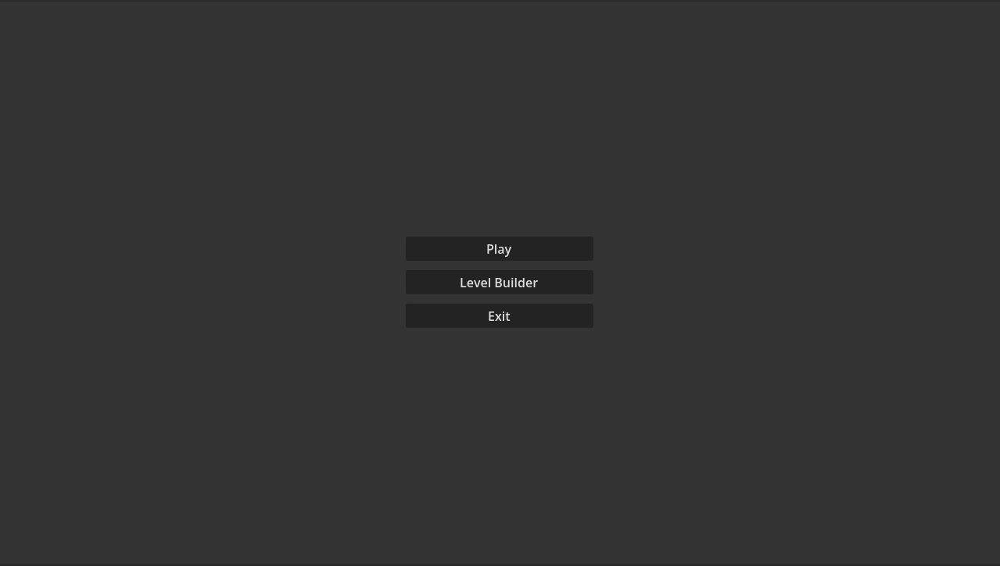
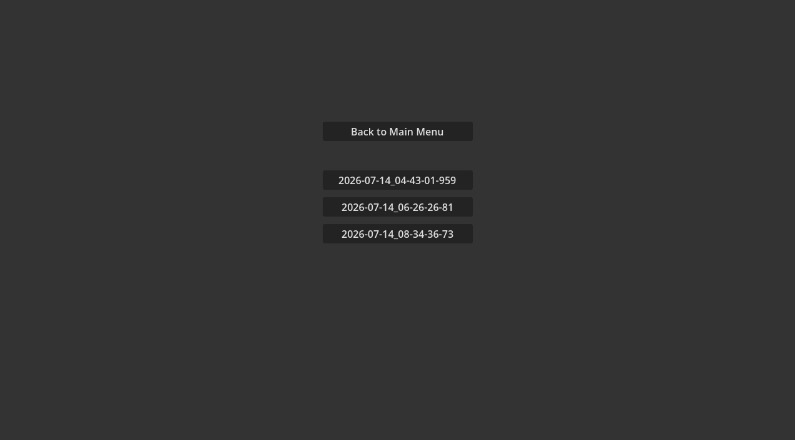
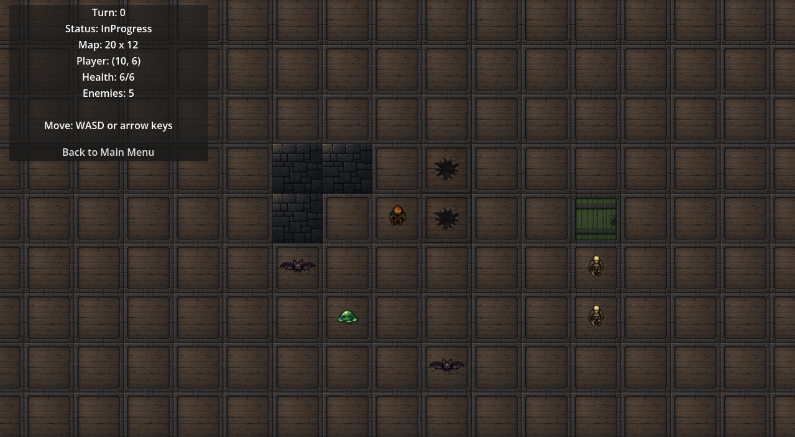
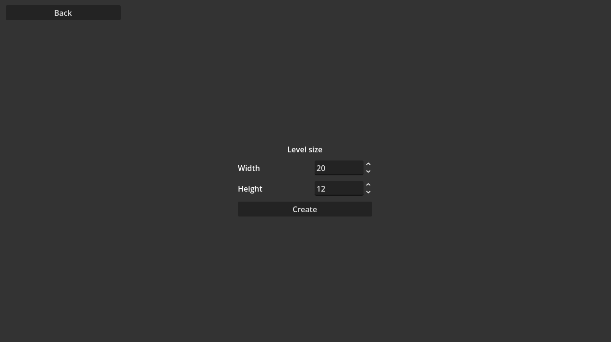
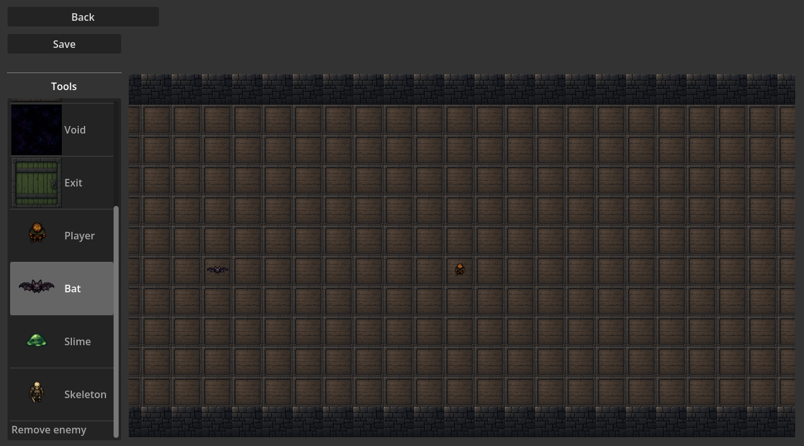

# RogueMaker User Guide

## 1. About the Game

RogueMaker is a turn-based game that includes a level builder. You can create a map, place the player and enemies, save the level, and then play it.

The main goals during a level are to defeat every enemy or reach an exit tile without losing all of your health.

## 2. Starting the Game

The main menu contains three buttons:

| Button | Action |
|---|---|
| `Play` | Open the list of saved levels |
| `Level Builder` | Create and save a new level |
| `Exit` | Close the game |



*Figure 1. The main menu.*

## 3. Playing a Level

### 3.1. Selecting a Level

1. Select `Play` in the main menu.
2. Select a level from the list.
3. The selected level starts immediately.



*Figure 2. Select one of the saved levels to start playing.*

If no levels have been saved, the level list displays `No levels`. Select `Back to Main Menu`, create a level in the level builder, and save it before trying again.

If a level cannot be loaded, an error message appears above the list.

### 3.2. Controls

| Action | Control |
|---|---|
| Move up | `W` or `Up Arrow` |
| Move down | `S` or `Down Arrow` |
| Move left | `A` or `Left Arrow` |
| Move right | `D` or `Right Arrow` |
| Leave the level | `Back to Main Menu` button |

The camera follows the player automatically.

### 3.3. Turns and Combat

RogueMaker is turn-based. Each movement key starts one complete turn:

1. The player performs an action.
2. Every enemy performs its action.
3. The game updates the map and status panel.

An attempted movement still uses a turn when the destination is blocked.

To attack an enemy, try to move into the enemy's tile. The player attacks automatically instead of moving. Enemies attack in the same way when they try to move into the player's tile.

### 3.4. Status Panel

The panel in the upper-left corner displays:

- the current turn number;
- the current game status;
- the map size;
- the player's position;
- the player's current and maximum health;
- the number of remaining enemies.



*Figure 3. The gameplay screen. The status panel is displayed in the upper-left corner.*

The possible game statuses are:

| Status | Meaning |
|---|---|
| `InProgress` | The level is still being played |
| `Won` | The player completed the level |
| `Lost` | The player was defeated |

### 3.5. Winning and Losing

You win after a turn if either of these conditions is met:

- every enemy has been defeated;
- the player is standing on an `Exit` tile.

You lose when the player's health reaches zero (you lose if you die on turn there you reach Exit).

## 4. Surfaces

Different surfaces affect which creatures can enter a tile.

| Surface | Walking creatures | Flying creatures | Effect |
|---|---:|---:|---|
| `Floor` | Yes | Yes | Normal traversable floor |
| `Wall` | No | No | Blocks all movement |
| `Pit` | No | Yes | Can only be crossed by flying creatures |
| `Void` | No | No | Blocks all movement |
| `Exit` | Yes | Yes | Completes the level when entered by the player |

The player, slime, and skeleton are walking creatures. The bat is a flying creature.

## 5. Creatures

| Creature | Health | Damage | Movement | Behaviour |
|---|---:|---:|---|---|
| Player | 6 | 1 | Walking | Controlled by the user |
| `Bat` | 1 | 1 | Flying | Chases the player |
| `Slime` | 1 | 0 | Walking | Waits in place |
| `Skeleton` | 3 | 2 | Walking | Chases the player |

HINT (not intended, but fun fact) Slime enemy is basically door/destroyable wall because it just stands and do ABSOLUTLY NOTHING.
## 6. Creating a Level

### 6.1. Choosing the Size

1. Select `Level Builder` in the main menu.
2. Enter the desired width in `Width`. (You can hold down the left mouse button to make the numbers change faster; you can also hold it down and move the mouse up or down to make the numbers change even faster. )
3. Enter the desired height in `Height`.
4. Select `Create`.



*Figure 4. Choose the width and height before creating a level.*

The width and height can each be between 1 and 100 tiles. The default size is 20 × 12 tiles.

A new level is filled with floor tiles and surrounded by walls. The player starts near the centre of the map. On maps that are only one or two tiles wide or high, walls may cover the entire map.

### 6.2. Editor Controls

| Action | Control |
|---|---|
| Select a tool | Left-click the tool in the tool panel |
| Edit one tile | Left-click a map tile |
| Paint multiple tiles | Hold the left mouse button and drag across the map |
| Zoom in or out | Scroll the mouse wheel over the map |
| Move around the map | Hold the middle mouse button and drag |
| Save your masterpiece |  Select Save |
| Return to the main menu | Select `Back` |

Select a tool before editing the map. Zooming and camera movement only work while the pointer is over the map area.



*Figure 5. The level builder. Tools are located on the left and the editable map is on the right.*

### 6.3. Surface Tools

The `Floor`, `Wall`, `Pit`, `Void`, and `Exit` tools change the surface of the selected tiles.

Changing a surface does not remove a creature standing on that tile.

### 6.4. Player and Enemy Tools

| Tool | Action |
|---|---|
| `Player` | Move the player to the selected tile |
| `Bat` | Place a bat or replace the enemy on the selected tile |
| `Slime` | Place a slime or replace the enemy on the selected tile |
| `Skeleton` | Place a skeleton or replace the enemy on the selected tile |
| `Remove enemy` | Remove the enemy from the selected tile |

Every level contains exactly one player. Using the `Player` tool moves the existing player instead of creating another one.

The player and an enemy cannot occupy the same tile. Applying a different enemy tool to an occupied enemy tile replaces the current enemy type.

The editor allows the player and enemies to be placed on any surface. Movement restrictions are only checked when a creature tries to enter another tile during the game. This makes unusual maps possible, but it can also create a level in which the player cannot move or win.

### 6.5. Saving the Level

Select `Save` to save the current level. The game creates the level name automatically from the current date and time, for example:

```text
2026-12-31_23-59-59-99
```

After a successful save, the new level name appears next to the button. If saving fails, an error message appears instead.

The `Back` button returns to the main menu without asking whether you want to save. Save the level before leaving the editor if you want to keep your changes.

## 7. Level Design Tips

- Make sure the player has at least one route across surfaces that allow walking.
- Use `Pit` to create routes or shortcuts intended only for bats.
- Place an `Exit` if you want the player to have an alternative to defeating every enemy.

## 8. Troubleshooting

### The level list displays `No levels`

Open `Level Builder`, create a level, and select `Save`.

### A tool does not change a tile

Make sure the tool is selected. The player cannot be placed on an enemy, and an enemy cannot be placed on the player. Applying the same value that is already present does not produce a visible change.

### The player cannot move

Check the surrounding surfaces and creatures. The player cannot enter `Wall`, `Pit`, or `Void` tiles and cannot move through another creature.

### A saved level does not start

Return to the level list and try selecting it again. If the error remains, the saved level may be damaged or incompatible and must be recreated.
